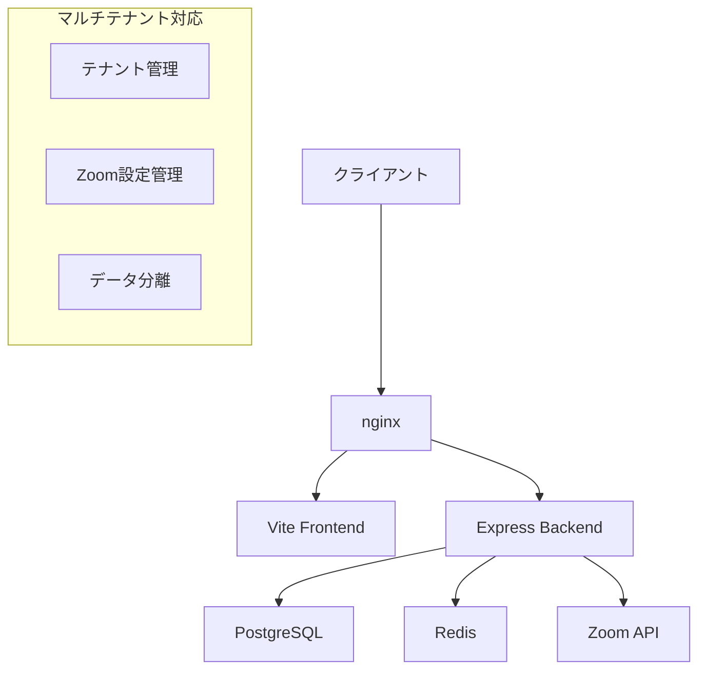

# Zoom議事録システム マルチテナント化提案書

## 📋 背景・課題

### 現在の状況
- **サブドメイン形式での展開を想定**していたが、運用面での課題が判明
- SSL証明書の準備とnginx.confの修正が**テナント追加毎に必要**
- 運用コストと管理複雑性の増大

### 提案する解決策
**サブディレクトリ形式**でのマルチテナント対応に変更

---

## 🎯 サブディレクトリ形式の優位性

### 運用管理面のメリット

| 項目 | サブドメイン形式 | サブディレクトリ形式 |
|------|------------------|---------------------|
| **SSL証明書** | テナント毎に必要 | **1つで全対応** ✅ |
| **nginx設定** | 毎回修正が必要 | **初回設定のみ** ✅ |
| **DNS設定** | テナント毎に必要 | **設定不要** ✅ |
| **運用コスト** | 高 | **低** ✅ |

### URL構造の比較

**サブドメイン形式:**
```
https://company1.zm01.ast-tools.online/dashboard
https://company2.zm01.ast-tools.online/dashboard
```

**サブディレクトリ形式（提案）:**
```
https://zm01.ast-tools.online/company1/dashboard
https://zm01.ast-tools.online/company2/dashboard
```

---

## 🏗️ システム構成設計

### アーキテクチャ概要



### データベース設計

```sql
-- テナントマスタ
CREATE TABLE tenants (
  id SERIAL PRIMARY KEY,
  tenant_id VARCHAR(8) UNIQUE NOT NULL,  -- 8桁英数字
  name VARCHAR(255) NOT NULL,
  admin_email VARCHAR(255),
  is_active BOOLEAN DEFAULT true,
  created_at TIMESTAMP DEFAULT CURRENT_TIMESTAMP
);

-- Zoom設定（テナント毎）
CREATE TABLE zoom_tenant_settings (
  tenant_id VARCHAR(8) REFERENCES tenants(tenant_id),
  zoom_api_key VARCHAR(255) NOT NULL,
  zoom_api_secret VARCHAR(255) NOT NULL,
  zoom_webhook_secret VARCHAR(255) NOT NULL,
  account_id VARCHAR(255),
  is_active BOOLEAN DEFAULT true
);

-- 既存テーブルにtenant_id追加
ALTER TABLE users ADD COLUMN tenant_id VARCHAR(8);
ALTER TABLE agent_jobs ADD COLUMN tenant_id VARCHAR(8);
ALTER TABLE meeting_transcripts ADD COLUMN tenant_id VARCHAR(8);
```

---

## 🔑 Zoom連携のテナント分離

### 現在の課題
- **環境変数ベース**でZoom認証情報を管理
- 全テナント共通設定のため、独立運用が不可能

### 提案する解決策

#### 1. データベースベースの設定管理
```javascript
// テナント毎のZoom設定取得
async function getZoomCredentials(tenantId) {
  const result = await query(
    'SELECT zoom_api_key, zoom_api_secret, zoom_webhook_secret 
     FROM zoom_tenant_settings 
     WHERE tenant_id = $1 AND is_active = true',
    [tenantId]
  );
  return result.rows[0];
}
```

#### 2. WebhookURLの変更
**現状:**
```
https://zm01.ast-tools.online/api/webhooks/zoom
```

**マルチテナント対応後:**
```
https://zm01.ast-tools.online/api/webhooks/zoom/a7b2c9f1
https://zm01.ast-tools.online/api/webhooks/zoom/3e8d4a6b
```

### テナントID生成方式

**採用案：UUID短縮版（8桁英数字）**
```javascript
function generateTenantId() {
  return crypto.randomBytes(4).toString('hex'); // 例: "a7b2c9f1"
}
```

**安全性:**
- 総パターン数: **約43億個**（16^8）
- 重複確率: 数字8桁の**430倍安全**
- URL安全で人間が読みやすい

---

## 🖥️ 管理機能の設計

### システム管理者向け機能

#### テナント管理画面
```
/admin/tenants              # テナント一覧
├── create                  # 新規テナント作成
├── [id]/edit              # 基本設定編集
├── [id]/zoom              # Zoom設定管理
├── [id]/users             # ユーザー管理
└── [id]/stats             # 使用統計
```

#### 管理項目
- **基本情報**: テナント名、管理者メール、ステータス
- **Zoom設定**: API Key、Secret、Webhook Secret
- **使用統計**: 議事録数、ストレージ使用量、アクティブユーザー数
- **権限管理**: テナント内ユーザーの権限設定

### テナント管理者向け機能

#### 設定画面
```
/:tenantId/settings/
├── general                # 基本設定
├── zoom                   # Zoom連携設定
├── users                  # ユーザー管理
└── billing               # 利用状況（将来拡張）
```

---

## 🚀 実装計画

### Phase 1: 基盤構築（2-3週間）

#### Week 1: データベース・認証基盤
- [ ] テナント管理テーブル作成
- [ ] 既存データのマイグレーション
- [ ] テナント識別機能の実装
- [ ] JWT認証にテナント情報追加

#### Week 2: Zoom連携改修
- [ ] テナント毎のZoom設定管理
- [ ] Webhook処理の修正
- [ ] VTTダウンロード・参加者取得の修正

#### Week 3: フロントエンド対応
- [ ] ルーティングの修正（/:tenant/...）
- [ ] API呼び出しの修正
- [ ] 認証フローの修正

### Phase 2: 管理機能（1-2週間）

#### Week 4: 管理画面開発
- [ ] テナント一覧・作成・編集画面
- [ ] Zoom設定管理画面
- [ ] ユーザー管理機能

#### Week 5: テスト・デバッグ
- [ ] 結合テスト
- [ ] パフォーマンステスト
- [ ] セキュリティテスト

---

## 📊 影響範囲と工数見積

### 修正が必要なコンポーネント

| コンポーネント | 修正規模 | 工数 |
|---------------|----------|------|
| **フロントエンド** | 大 | 1.5週間 |
| - ルーティング | 全面修正 | 3日 |
| - API呼び出し | 全面修正 | 3日 |
| - 認証フロー | 大幅修正 | 2日 |
| **バックエンド** | 中 | 1週間 |
| - 認証ミドルウェア | 修正 | 2日 |
| - Webhook処理 | 修正 | 2日 |
| - データベース層 | 修正 | 3日 |
| **インフラ** | 小 | 1日 |
| - nginx設定 | 軽微修正 | 1日 |

### 総工数見積
- **開発**: 3-4週間
- **テスト**: 1週間
- **デプロイ・移行**: 3日

**合計: 約1ヶ月**

---

## 💰 コスト・リスク分析

### 運用コスト削減効果

| 項目 | 従来（サブドメイン） | 提案（サブディレクトリ） | 削減効果 |
|------|---------------------|------------------------|----------|
| SSL証明書 | ¥10,000/年・テナント | ¥10,000/年（共通） | **90%削減** |
| DNS管理 | ¥2,000/年・テナント | ¥0 | **100%削減** |
| 設定作業 | 2時間/テナント | 0時間 | **100%削減** |

### リスク要因と対策

| リスク | 影響度 | 対策 |
|-------|--------|------|
| **既存ブックマーク無効化** | 中 | リダイレクト機能で対応 |
| **データ移行失敗** | 高 | 段階的移行・ロールバック計画 |
| **テナント間データ漏洩** | 高 | 厳密な権限チェック実装 |

---

## 🎯 推奨事項

### 即座に実施すべき事項
1. **サブディレクトリ形式への方針変更承認**
2. **開発リソースの確保**（1ヶ月間）
3. **テスト環境での実証実験**

### 段階的導入計画
1. **Phase 1**: 既存システムをdefaultテナントとして運用継続
2. **Phase 2**: 新規テナントをサブディレクトリ形式で追加
3. **Phase 3**: 管理機能の充実化

---

## 📈 期待効果

### 短期効果（3ヶ月以内）
- **運用工数90%削減**
- **新規テナント追加時間: 2時間 → 5分**
- **SSL・DNS管理コスト削減**

### 長期効果（6ヶ月以降）
- **スケーラブルな成長基盤の確立**
- **運用自動化の実現**
- **顧客獲得コストの削減**

---

## 🔚 結論

**サブディレクトリ形式でのマルチテナント化**は、
- **運用コストの大幅削減**
- **開発・保守性の向上**  
- **スケーラブルな成長基盤**

を実現する最適解です。

**提案**: 本方式での開発着手を強く推奨いたします。