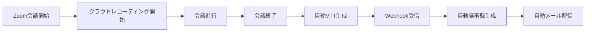
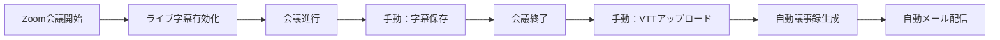
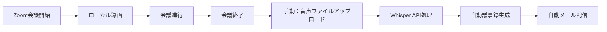

# VTTファイル利用とクラウドレコーディング要件ガイド

## 📋 概要

AIエージェントサービスでコスト最適化を実現するVTTファイル利用について、自動化レベル別の要件と運用方法を詳しく説明します。

## 🎯 VTTファイルとは

**VTT（WebVTT: Web Video Text Tracks）** は、動画の字幕・キャプション情報を格納するファイル形式です。

### VTTファイルの利点
- ✅ **発言者情報**: 誰が何を発言したかが明確
- ✅ **タイムスタンプ**: 正確な発言時刻を記録
- ✅ **コスト削減**: OpenAI Whisper API使用料を90%削減
- ✅ **処理速度**: 音声解析より高速（API呼び出し不要）
- ✅ **高精度**: Zoomの音声認識技術を活用

### VTTファイル形式例
```vtt
WEBVTT

00:00:17.000 --> 00:00:19.000
61246  上辻としゆき: はい。こんばんは。

00:00:19.000 --> 00:00:22.000  
61246  上辻としゆき: 見えてるかな？オーディオ入ってますね。

00:01:30.000 --> 00:01:35.000
61247  田中太郎: 議題について説明させていただきます。
```

## 🔄 自動化レベル別運用方法

### 🏆 **レベル1: 完全自動化**

#### 要件
- ✅ **Zoom有料プラン必須**（Pro/Business/Enterprise）
- ✅ **クラウドレコーディング必須**
- ✅ **文字起こし機能有効化**

#### ワークフロー


#### 設定手順
1. **Zoomプロプラン契約**
2. **管理者設定**:
   ```
   設定 → レコーディング → クラウドレコーディング
   ├── 自動レコーディング: 有効
   ├── 音声の文字起こし: 有効
   ├── 音声の文字起こしを自動保存: 有効
   └── 録画への文字起こし統合: 有効
   ```
3. **Webhook設定**:
   ```
   Zoom Marketplace → アプリ管理 → Event Subscriptions
   ├── recording.completed: 有効
   └── meeting.ended: 有効
   ```

#### 運用コスト
| 項目 | 費用 |
|------|------|
| Zoom Pro プラン | $14.99/月 |
| Whisper API | **$0**（VTT使用） |
| 人的作業コスト | **$0**（完全自動） |

### 🔶 **レベル2: 半自動化**

#### 要件
- ✅ **Zoom無料プランでも可能**
- ⚠️ **手動作業が必要**（VTT保存・アップロード）

#### ワークフロー


#### 設定手順
1. **Zoom基本プラン**（無料）
2. **会議中操作**:
   ```
   会議画面下部 → 字幕ボタンクリック
   ├── 自動生成字幕を有効にする
   ├── 字幕表示確認
   └── 会議終了前に「字幕を保存」クリック
   ```
3. **手動アップロード**:
   ```
   AI Agent Service → 音声アップロード
   ├── VTTファイル選択
   ├── 会議タイトル入力
   └── アップロード実行
   ```

#### 運用コスト
| 項目 | 費用 |
|------|------|
| Zoom基本プラン | **$0** |
| Whisper API | **$0**（VTT使用） |
| 人的作業コスト | 約5分/会議 |

### 🔸 **レベル3: 音声ファイル処理**

#### 要件
- ✅ **Zoom無料プランでも可能**
- ❌ **Whisper API費用発生**

#### ワークフロー


#### 運用コスト
| 項目 | 費用 |
|------|------|
| Zoom基本プラン | **$0** |
| Whisper API | $0.006/分（30分会議=$0.18） |
| 人的作業コスト | 約3分/会議 |

## 📊 コスト比較分析

### 月間10回会議（各30分）の場合

| 運用方式 | Zoomプラン | API費用 | 作業時間 | 月額総コスト |
|----------|------------|---------|----------|-------------|
| **完全自動化** | $14.99 | $0 | 0分 | **$14.99** |
| **半自動化** | $0 | $0 | 50分 | **$0**（作業時間除く） |
| **音声処理** | $0 | $1.80 | 30分 | **$1.80**（作業時間除く） |

### 月間50回会議（各30分）の場合

| 運用方式 | Zoomプラン | API費用 | 作業時間 | 月額総コスト |
|----------|------------|---------|----------|-------------|
| **完全自動化** | $14.99 | $0 | 0分 | **$14.99** |
| **半自動化** | $0 | $0 | 250分 | **$0**（作業時間除く） |
| **音声処理** | $0 | $9.00 | 150分 | **$9.00**（作業時間除く） |

## 🎯 推奨運用方式

### 🏢 **企業・組織利用**
```
推奨: 完全自動化（レベル1）
理由:
├── 人的作業コストの削減
├── 会議品質の向上（録画忘れ防止）
├── コンプライアンス対応
└── スケーラビリティ
```

### 👤 **個人・小規模利用**
```
推奨: 半自動化（レベル2）
理由:
├── 初期コスト抑制
├── 必要な会議のみ処理
├── VTT品質の事前確認可能
└── 柔軟な運用
```

### 🔬 **検証・テスト利用**
```
推奨: 音声ファイル処理（レベル3）
理由:
├── 最小限の設定
├── 様々なファイル形式対応
├── システム動作確認
└── 移行前の検証
```

## ⚙️ 技術的実装詳細

### VTT優先処理フロー

システムは以下の優先順位で処理を行います：

```javascript
// 1. VTTファイルの確認
if (recordingData.vttFile && recordingData.vttFile.download_url) {
    console.log('🎯 VTTファイルが利用可能です。VTT解析を実行します...');
    // VTT解析処理
    const vttAnalysis = zoomUtils.parseVTTContent(vttContent);
    if (vttAnalysis.success) {
        // VTT処理成功 → Whisper API不使用
        return vttAnalysis.chronologicalTranscript;
    }
}

// 2. VTT利用不可の場合のフォールバック
console.log('📝 VTTファイルが利用できません。Whisper APIを使用します。');
// Whisper API処理
```

### ログ出力例

#### VTT処理成功時
```
🎯 VTTファイルが利用可能です。VTT解析を実行します...
✅ VTT解析成功: {speakers: 3, transcriptLength: 1247, qualityScore: 92}
💰 コスト削減: Whisper API使用料 $0.18 節約
```

#### VTT処理失敗時
```
📝 VTTファイルが利用できません。Whisper APIを使用します。
🎙️ Whisper APIで文字起こしを実行します...
💸 Whisper API使用料: $0.18 (30分会議)
```

## 🚀 導入ステップ

### Phase 1: 評価・検証（1週間）
1. **現状把握**
   - 月間会議頻度・時間の調査
   - 現在のZoomプラン確認
   - コスト試算

2. **テスト実施**
   - レベル3（音声ファイル）でシステム動作確認
   - 議事録品質の評価
   - ワークフロー適合性確認

### Phase 2: 運用方式決定（1週間）
1. **コスト比較**
   - 各レベルの総コスト計算
   - ROI（投資対効果）分析

2. **運用負荷評価**
   - 手動作業の受容性
   - 自動化による効果測定

### Phase 3: 本格導入（2週間）
1. **環境構築**
   - 選択した運用方式の設定
   - 必要に応じてZoomプランアップグレード

2. **運用開始**
   - チーム向け操作説明
   - 運用ルール策定
   - 効果測定開始

## 📞 サポート・トラブルシューティング

### よくある質問

#### Q1: 無料プランでVTTファイルは取得できますか？
**A1**: はい、可能です。会議中に「字幕」機能を有効にし、「字幕を保存」で.vttファイルをダウンロードできます。ただし手動作業が必要です。

#### Q2: VTTファイルの品質が悪い場合は？
**A2**: システムが自動的にWhisper APIにフォールバックします。VTT品質スコアが50点以下の場合、自動的に音声処理に切り替わります。

#### Q3: クラウドレコーディングでVTTが生成されない場合は？
**A3**: 以下を確認してください：
- 音声の文字起こし設定が有効
- 会議言語が対応言語（日本語・英語等）
- 音声品質が十分（ノイズが少ない）

### トラブルシューティング

#### VTTファイルが見つからない
```bash
# デバッグダッシュボードで確認
http://localhost:3000/debug
→ 「録画データ取得テスト」実行
→ recording_files内容確認
```

#### 文字起こし精度が低い
```
対策:
1. 会議室の音響環境改善
2. 外部マイク使用
3. 発言者の明瞭な発話
4. 背景ノイズの削減
```

## 📈 効果測定指標

### 定量的指標
- **コスト削減率**: (従来費用 - 新費用) / 従来費用 × 100
- **処理時間短縮**: VTT処理時間 vs Whisper処理時間
- **自動化率**: 手動作業時間の削減

### 定性的指標
- **議事録品質**: 発言者識別精度、内容正確性
- **ユーザー満足度**: 操作の簡便性、結果の有用性
- **業務効率**: 会議後作業時間の削減

## 🔮 将来展望

### 短期改善（3ヶ月）
- リアルタイム字幕の活用拡大
- VTT品質向上アルゴリズム
- 多言語対応強化

### 中期発展（6ヶ月）
- Microsoft Teams、Google Meet対応
- AIによる発言要約・分析機能
- 議事録テンプレート自動生成

### 長期ビジョン（1年）
- リアルタイム議事録生成
- 音声認識精度向上
- 統合会議管理プラットフォーム

---

**作成日**: 2025年7月10日  
**バージョン**: 1.0  
**対象システム**: AIエージェントサービス - Zoom議事録自動配布システム  
**最終更新**: VTT優先処理実装完了後