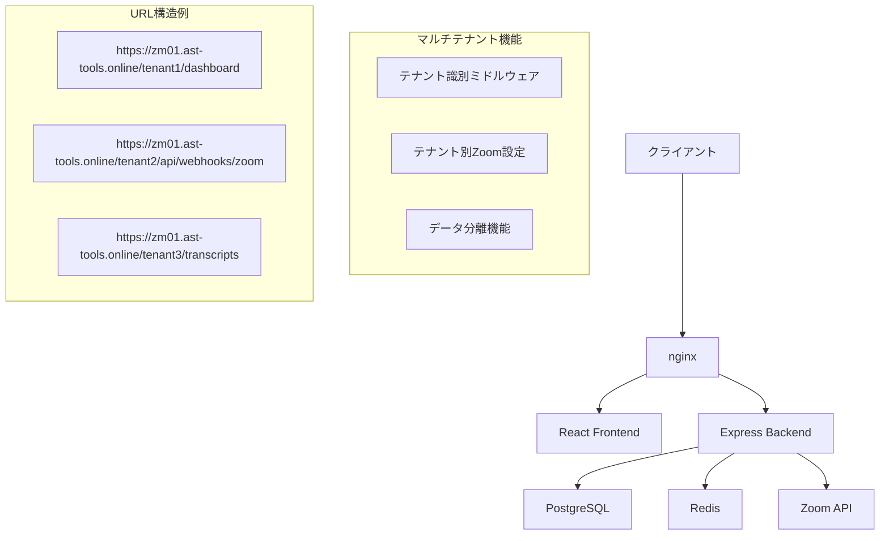

# Zoom議事録システム サブディレクトリ方式マルチテナント化 仕様書

## 📋 プロジェクト概要

### 目的
既存のZoom議事録自動配布システムを、サブディレクトリ形式でのマルチテナント対応に変更し、運用コストの大幅削減と管理効率の向上を図る。

### 変更方針
- **変更前**: サブドメイン形式（`https://company1.zm01.ast-tools.online/dashboard`）
- **変更後**: サブディレクトリ形式（`https://zm01.ast-tools.online/company1/dashboard`）

### 主要メリット
- SSL証明書コスト: **90%削減**（テナント毎→1つで全対応）
- nginx設定: **100%自動化**（毎回修正→初回設定のみ）
- DNS設定: **不要**（テナント毎設定→設定不要）
- 新規テナント追加時間: **2時間→5分**（96%短縮）

---

## 🏗️ システム設計

### アーキテクチャ概要



### システム構成

```
ブラウザ → nginx → テナント識別 → アプリケーション
                     ↓
              /:tenantId/dashboard → Frontend
              /:tenantId/api/*     → Backend
              /:tenantId/webhooks/* → Webhook Handler
```

---

## 🗄️ データベース設計

### 新規テーブル

#### 1. tenants（テナント管理）
```sql
CREATE TABLE tenants (
    id SERIAL PRIMARY KEY,
    tenant_id VARCHAR(8) UNIQUE NOT NULL,  -- 8桁英数字（例: a7b2c9f1）
    name VARCHAR(255) NOT NULL,
    admin_email VARCHAR(255),
    is_active BOOLEAN DEFAULT true,
    created_at TIMESTAMP DEFAULT CURRENT_TIMESTAMP,
    updated_at TIMESTAMP DEFAULT CURRENT_TIMESTAMP
);
```

#### 2. zoom_tenant_settings（テナント別Zoom設定）
```sql
CREATE TABLE zoom_tenant_settings (
    id SERIAL PRIMARY KEY,
    tenant_id VARCHAR(8) REFERENCES tenants(tenant_id) ON DELETE CASCADE,
    zoom_api_key VARCHAR(255) NOT NULL,
    zoom_api_secret VARCHAR(255) NOT NULL,
    zoom_webhook_secret VARCHAR(255) NOT NULL,
    zoom_account_id VARCHAR(255),
    is_active BOOLEAN DEFAULT true,
    created_at TIMESTAMP DEFAULT CURRENT_TIMESTAMP,
    updated_at TIMESTAMP DEFAULT CURRENT_TIMESTAMP
);
```

### 既存テーブル修正

#### テナントID追加
```sql
-- 全ての主要テーブルにテナントID追加
ALTER TABLE users ADD COLUMN tenant_id VARCHAR(8) REFERENCES tenants(tenant_id);
ALTER TABLE agent_jobs ADD COLUMN tenant_id VARCHAR(8) REFERENCES tenants(tenant_id);
ALTER TABLE meeting_transcripts ADD COLUMN tenant_id VARCHAR(8) REFERENCES tenants(tenant_id);
ALTER TABLE distribution_logs ADD COLUMN tenant_id VARCHAR(8) REFERENCES tenants(tenant_id);

-- ユーザーロールにテナント管理者を追加
ALTER TABLE users ADD CONSTRAINT check_user_role 
    CHECK (role IN ('admin', 'user', 'tenant_admin'));

-- テナント管理者制限（自分のテナントのみアクセス可能）
CREATE INDEX idx_users_tenant_role ON users(tenant_id, role);

-- インデックス追加（パフォーマンス最適化）
CREATE INDEX idx_users_tenant_id ON users(tenant_id);
CREATE INDEX idx_agent_jobs_tenant_id ON agent_jobs(tenant_id);
CREATE INDEX idx_meeting_transcripts_tenant_id ON meeting_transcripts(tenant_id);
CREATE INDEX idx_distribution_logs_tenant_id ON distribution_logs(tenant_id);
```

---

## 🔑 テナントID生成システム

### 生成方式: UUID短縮版（8桁英数字）

#### 特徴
- **安全性**: 約43億個のパターン（16^8）
- **可読性**: 人間が読みやすい8文字
- **URL安全**: URLパスに直接使用可能
- **重複回避**: crypto.randomBytes()による確実な生成

#### 生成ロジック
```javascript
function generateTenantId() {
    let tenantId;
    let attempts = 0;
    const maxAttempts = 10;
    
    do {
        tenantId = crypto.randomBytes(4).toString('hex');
        attempts++;
        
        // データベースで重複チェック
        const exists = await checkTenantIdExists(tenantId);
        if (!exists) {
            return tenantId;
        }
    } while (attempts < maxAttempts);
    
    throw new Error('テナントID生成に失敗しました。再試行してください。');
}

// 例: "a7b2c9f1", "3e8d4a6b", "9f1c7e2a"
```

---

## 🌐 ルーティング設計

### URL構造

#### フロントエンドルート
```
https://zm01.ast-tools.online/:tenantId/
├── dashboard              # ダッシュボード
├── transcripts           # 議事録一覧
├── transcripts/:id       # 議事録詳細
├── jobs                  # ジョブ履歴
├── profile              # プロフィール設定
├── settings             # テナント設定
└── login                # ログイン画面
```

#### バックエンドAPIルート
```
https://zm01.ast-tools.online/:tenantId/api/
├── auth/                # 認証関連
├── transcripts/         # 議事録CRUD
├── agent/               # ジョブ管理
├── webhooks/zoom        # Zoom Webhook受信
└── admin/               # 管理機能（システム管理者のみ）
```

#### システム管理ルート
```
https://zm01.ast-tools.online/admin/
├── tenants                    # テナント管理
├── tenants/:id/edit          # テナント編集
├── tenants/:id/zoom          # Zoom設定管理
├── tenants/:id/users         # ユーザー管理
├── tenants/:id/users/create  # テナント管理者作成
├── tenants/:id/users/:userId/edit # テナント管理者編集
└── tenants/:id/stats         # 使用統計
```

---

## 🔧 バックエンド実装

### 1. テナント識別ミドルウェア

```javascript
// middleware/tenantMiddleware.js
const tenantMiddleware = async (req, res, next) => {
    try {
        // URLからテナントID抽出
        const tenantId = req.params.tenantId || extractTenantFromPath(req.path);
        
        if (!tenantId) {
            return res.status(400).json({
                error: 'テナントIDが指定されていません',
                code: 'TENANT_ID_REQUIRED'
            });
        }
        
        // テナント存在確認
        const tenant = await getTenant(tenantId);
        if (!tenant || !tenant.is_active) {
            return res.status(404).json({
                error: '指定されたテナントが見つかりません',
                code: 'TENANT_NOT_FOUND'
            });
        }
        
        // リクエストオブジェクトにテナント情報を追加
        req.tenant = tenant;
        req.tenantId = tenantId;
        
        next();
    } catch (error) {
        console.error('テナント識別エラー:', error);
        return res.status(500).json({
            error: 'テナント識別に失敗しました',
            code: 'TENANT_IDENTIFICATION_FAILED'
        });
    }
};

// パスからテナントID抽出
function extractTenantFromPath(path) {
    const match = path.match(/^\/([a-f0-9]{8})\//);
    return match ? match[1] : null;
}
```

### 2. テナント別Zoom設定取得

```javascript
// services/tenantZoomService.js
class TenantZoomService {
    // テナント別Zoom認証情報取得
    async getZoomCredentials(tenantId) {
        const query = `
            SELECT 
                zoom_api_key,
                zoom_api_secret,
                zoom_webhook_secret,
                zoom_account_id
            FROM zoom_tenant_settings 
            WHERE tenant_id = $1 AND is_active = true
        `;
        
        const result = await db.query(query, [tenantId]);
        
        if (result.rows.length === 0) {
            throw new Error(`テナント ${tenantId} のZoom設定が見つかりません`);
        }
        
        return result.rows[0];
    }
    
    // テナント別Zoom APIクライアント生成
    async createZoomClient(tenantId) {
        const credentials = await this.getZoomCredentials(tenantId);
        
        return new ZoomApiClient({
            apiKey: credentials.zoom_api_key,
            apiSecret: credentials.zoom_api_secret,
            accountId: credentials.zoom_account_id
        });
    }
    
    // Webhook署名検証（テナント別）
    async verifyWebhookSignature(tenantId, payload, signature, timestamp) {
        const credentials = await this.getZoomCredentials(tenantId);
        
        return verifyZoomWebhookSignature(
            payload,
            signature,
            timestamp,
            credentials.zoom_webhook_secret
        );
    }
}
```

### 3. データアクセス層修正

```javascript
// models/baseModel.js
class BaseModel {
    constructor(tableName) {
        this.tableName = tableName;
    }
    
    // テナント制限付きクエリ
    async findByTenant(tenantId, conditions = {}) {
        const whereClause = Object.keys(conditions)
            .map((key, index) => `${key} = $${index + 2}`)
            .join(' AND ');
        
        const query = `
            SELECT * FROM ${this.tableName} 
            WHERE tenant_id = $1 
            ${whereClause ? 'AND ' + whereClause : ''}
            ORDER BY created_at DESC
        `;
        
        const values = [tenantId, ...Object.values(conditions)];
        const result = await db.query(query, values);
        
        return result.rows;
    }
    
    // テナント制限付き作成
    async createWithTenant(tenantId, data) {
        const fields = Object.keys(data);
        const values = Object.values(data);
        
        const query = `
            INSERT INTO ${this.tableName} (tenant_id, ${fields.join(', ')})
            VALUES ($1, ${fields.map((_, i) => `$${i + 2}`).join(', ')})
            RETURNING *
        `;
        
        const result = await db.query(query, [tenantId, ...values]);
        return result.rows[0];
    }
}
```

---

## 🎨 フロントエンド実装

### 1. ルーター設定

```typescript
// router/AppRouter.tsx
import { createBrowserRouter, RouterProvider } from 'react-router-dom';
import { TenantLayout } from '../layouts/TenantLayout';

const router = createBrowserRouter([
    // システム管理ルート
    {
        path: '/admin',
        element: <AdminLayout />,
        children: [
            { path: 'tenants', element: <TenantListPage /> },
            { path: 'tenants/:id/edit', element: <TenantEditPage /> },
            { path: 'tenants/:id/zoom', element: <ZoomSettingsPage /> },
            { path: 'tenants/:id/users', element: <UserManagementPage /> },
            { path: 'tenants/:id/users/create', element: <TenantAdminCreatePage /> },
            { path: 'tenants/:id/users/:userId/edit', element: <TenantAdminEditPage /> },
        ]
    },
    
    // テナント別ルート
    {
        path: '/:tenantId',
        element: <TenantLayout />,
        children: [
            { path: 'dashboard', element: <DashboardPage /> },
            { path: 'transcripts', element: <TranscriptsPage /> },
            { path: 'transcripts/:id', element: <TranscriptDetailPage /> },
            { path: 'jobs', element: <JobsPage /> },
            { path: 'profile', element: <ProfilePage /> },
            { path: 'settings', element: <SettingsPage /> },
            { path: 'tenant-settings', element: <TenantSettingsPage /> }, // テナント管理者専用
            { path: 'login', element: <LoginPage /> },
        ]
    },
    
    // ルートリダイレクト
    {
        path: '/',
        element: <RootRedirect />
    }
]);
```

### 2. テナントコンテキスト

```typescript
// contexts/TenantContext.tsx
interface TenantContextType {
    tenant: Tenant | null;
    tenantId: string | null;
    isLoading: boolean;
    error: string | null;
}

export const TenantProvider: React.FC<{ children: React.ReactNode }> = ({ children }) => {
    const { tenantId } = useParams<{ tenantId: string }>();
    const [tenant, setTenant] = useState<Tenant | null>(null);
    const [isLoading, setIsLoading] = useState(true);
    const [error, setError] = useState<string | null>(null);
    
    useEffect(() => {
        if (tenantId) {
            loadTenant(tenantId);
        }
    }, [tenantId]);
    
    const loadTenant = async (id: string) => {
        try {
            setIsLoading(true);
            setError(null);
            
            const response = await api.get(`/api/tenants/${id}`);
            setTenant(response.data.tenant);
        } catch (err) {
            setError('テナント情報の取得に失敗しました');
            console.error('テナント取得エラー:', err);
        } finally {
            setIsLoading(false);
        }
    };
    
    return (
        <TenantContext.Provider value={{ tenant, tenantId, isLoading, error }}>
            {children}
        </TenantContext.Provider>
    );
};
```

### 3. API クライアント修正

```typescript
// lib/api.ts
class ApiClient {
    private baseURL: string;
    private tenantId: string | null = null;
    
    constructor() {
        this.baseURL = import.meta.env.VITE_API_URL || 'http://localhost:8000';
    }
    
    // テナントIDを設定
    setTenantId(tenantId: string) {
        this.tenantId = tenantId;
    }
    
    // テナント付きURL生成
    private buildUrl(endpoint: string): string {
        if (this.tenantId && !endpoint.startsWith('/admin/')) {
            return `${this.baseURL}/${this.tenantId}${endpoint}`;
        }
        return `${this.baseURL}${endpoint}`;
    }
    
    // APIリクエスト
    async request(method: string, endpoint: string, data?: any) {
        const url = this.buildUrl(endpoint);
        
        const config: any = {
            method,
            url,
            headers: {
                'Content-Type': 'application/json',
                ...this.getAuthHeaders()
            }
        };
        
        if (data) {
            config.data = data;
        }
        
        try {
            const response = await axios(config);
            return response.data;
        } catch (error) {
            this.handleApiError(error);
            throw error;
        }
    }
}
```

---

## 🔒 セキュリティ設計

### 1. テナント間データ分離

#### データアクセス制御
```javascript
// すべてのデータアクセスでテナントIDを必須条件とする
const getTranscripts = async (tenantId, userId) => {
    const query = `
        SELECT mt.* 
        FROM meeting_transcripts mt
        JOIN users u ON mt.created_by_uuid = u.user_uuid
        WHERE mt.tenant_id = $1 AND u.user_uuid = $2
        ORDER BY mt.created_at DESC
    `;
    
    return await db.query(query, [tenantId, userId]);
};
```

#### 認証・認可
```javascript
// JWT トークンにテナント情報を含める
const generateToken = (user, tenant) => {
    return jwt.sign({
        userId: user.user_uuid,
        tenantId: tenant.tenant_id,
        role: user.role,
        iss: 'zoom-minutes-system',
        aud: tenant.tenant_id
    }, JWT_SECRET, { expiresIn: '24h' });
};

// テナント認証ミドルウェア
const authenticateWithTenant = (req, res, next) => {
    const token = extractToken(req);
    const decoded = jwt.verify(token, JWT_SECRET);
    
    // URLのテナントIDとトークンのテナントIDが一致するかチェック
    if (decoded.tenantId !== req.tenantId) {
        return res.status(403).json({
            error: 'テナントアクセス権限がありません',
            code: 'TENANT_ACCESS_DENIED'
        });
    }
    
    req.user = decoded;
    next();
};

// 権限チェックミドルウェア
const requireRole = (allowedRoles) => {
    return (req, res, next) => {
        if (!req.user) {
            return res.status(401).json({
                error: '認証が必要です',
                code: 'AUTHENTICATION_REQUIRED'
            });
        }
        
        if (!allowedRoles.includes(req.user.role)) {
            return res.status(403).json({
                error: 'この操作を実行する権限がありません',
                code: 'INSUFFICIENT_PERMISSIONS'
            });
        }
        
        next();
    };
};

// テナント管理者アクセス制御
const requireTenantAdminAccess = (req, res, next) => {
    const { role, tenantId: userTenantId } = req.user;
    const targetTenantId = req.params.tenantId || req.tenantId;
    
    // システム管理者は全テナントにアクセス可能
    if (role === 'admin') {
        return next();
    }
    
    // テナント管理者は自分のテナントのみアクセス可能
    if (role === 'tenant_admin' && userTenantId === targetTenantId) {
        return next();
    }
    
    return res.status(403).json({
        error: 'テナント管理権限がありません',
        code: 'TENANT_ADMIN_ACCESS_DENIED'
    });
};
```

### 2. Webhook セキュリティ

#### テナント別Webhook URL
```javascript
// 新しいWebhook URL構造
const webhookUrls = {
    tenant1: 'https://zm01.ast-tools.online/a7b2c9f1/api/webhooks/zoom',
    tenant2: 'https://zm01.ast-tools.online/3e8d4a6b/api/webhooks/zoom',
    tenant3: 'https://zm01.ast-tools.online/9f1c7e2a/api/webhooks/zoom'
};

// Webhook処理でテナント別署名検証
app.post('/:tenantId/api/webhooks/zoom', async (req, res) => {
    const { tenantId } = req.params;
    
    try {
        // テナント別Zoom設定取得
        const zoomSettings = await getTenantZoomSettings(tenantId);
        
        // 署名検証
        const isValid = verifyZoomSignature(
            req.body,
            req.headers['x-zoom-webhook-signature'],
            req.headers['x-zoom-webhook-timestamp'],
            zoomSettings.zoom_webhook_secret
        );
        
        if (!isValid) {
            return res.status(401).json({ error: 'Invalid signature' });
        }
        
        // テナント固有の処理
        await processWebhookForTenant(tenantId, req.body);
        
        res.status(200).json({ status: 'success' });
    } catch (error) {
        console.error(`Webhook処理エラー (テナント: ${tenantId}):`, error);
        res.status(500).json({ error: 'Internal server error' });
    }
});
```

---

## 🌐 nginx設定

### メインの設定ファイル
```nginx
# /etc/nginx/sites-available/zm01.ast-tools.online.conf

server {
    listen 443 ssl http2;
    server_name zm01.ast-tools.online;
    
    # SSL設定
    ssl_certificate /etc/letsencrypt/live/zm01.ast-tools.online/fullchain.pem;
    ssl_certificate_key /etc/letsencrypt/live/zm01.ast-tools.online/privkey.pem;
    
    # セキュリティヘッダー
    add_header X-Frame-Options "SAMEORIGIN" always;
    add_header X-Content-Type-Options "nosniff" always;
    add_header X-XSS-Protection "1; mode=block" always;
    
    # システム管理者ルート
    location /admin/ {
        proxy_pass http://localhost:8000/admin/;
        proxy_set_header Host $host;
        proxy_set_header X-Real-IP $remote_addr;
        proxy_set_header X-Forwarded-For $proxy_add_x_forwarded_for;
        proxy_set_header X-Forwarded-Proto $scheme;
    }
    
    # テナント別APIルート（8桁英数字のテナントID）
    location ~ ^/([a-f0-9]{8})/api/ {
        proxy_pass http://localhost:8000/$1/api/;
        proxy_set_header Host $host;
        proxy_set_header X-Real-IP $remote_addr;
        proxy_set_header X-Forwarded-For $proxy_add_x_forwarded_for;
        proxy_set_header X-Forwarded-Proto $scheme;
        
        # Webhook用の特別設定
        if ($uri ~ "^/([a-f0-9]{8})/api/webhooks/zoom") {
            proxy_read_timeout 300s;
            proxy_send_timeout 300s;
        }
    }
    
    # テナント別フロントエンドルート
    location ~ ^/([a-f0-9]{8})/ {
        proxy_pass http://localhost:3000/;
        proxy_set_header Host $host;
        proxy_set_header X-Real-IP $remote_addr;
        proxy_set_header X-Forwarded-For $proxy_add_x_forwarded_for;
        proxy_set_header X-Forwarded-Proto $scheme;
        proxy_set_header X-Tenant-ID $1;
    }
    
    # ルートアクセス処理
    location = / {
        return 302 /admin/;
    }
    
    # 静的ファイル配信（React Vite）
    location ~ ^/([a-f0-9]{8})/assets/ {
        proxy_pass http://localhost:3000/assets/;
        expires 1y;
        add_header Cache-Control "public, immutable";
    }
}
```

---

## 🚀 実装フェーズ

### Phase 1: 基盤構築（2-3週間）

#### Week 1: データベース・認証基盤
- [ ] **テナント管理テーブル作成**
  - `tenants`テーブル設計・作成
  - `zoom_tenant_settings`テーブル設計・作成
  - テナントID生成機能実装

- [ ] **既存データのマイグレーション**
  - 既存データをデフォルトテナントに移行
  - UUIDとテナントIDの整合性確保
  - データ整合性検証

- [ ] **テナント識別機能実装**
  - テナント識別ミドルウェア作成
  - URLルーティング修正
  - エラーハンドリング実装

- [ ] **JWT認証にテナント情報追加**
  - トークン構造変更
  - 認証ミドルウェア修正
  - セッション管理更新

#### Week 2: Zoom連携改修
- [ ] **テナント別Zoom設定管理**
  - 設定取得サービス実装
  - 暗号化保存機能
  - 設定検証機能

- [ ] **Webhook処理修正**
  - テナント別URL対応
  - 署名検証のテナント対応
  - エラーハンドリング強化

- [ ] **VTTダウンロード・参加者取得修正**
  - テナント別認証情報使用
  - API呼び出し修正
  - エラー処理統一

#### Week 3: フロントエンド対応
- [ ] **ルーティング修正**
  - React Router設定変更
  - テナントパラメータ対応
  - ナビゲーション修正

- [ ] **API呼び出し修正**
  - APIクライアント更新
  - テナントIDヘッダー追加
  - エラーハンドリング統一

- [ ] **認証フロー修正**
  - ログイン画面更新
  - テナント切り替え機能
  - セッション管理修正

### Phase 2: 管理機能（1-2週間）

#### Week 4: 管理画面開発
- [ ] **テナント一覧・作成・編集画面**
  - 管理者ダッシュボード
  - テナント作成ウィザード
  - 基本情報編集機能

- [ ] **Zoom設定管理画面**
  - 認証情報入力フォーム
  - 接続テスト機能
  - セキュア保存機能

- [ ] **ユーザー管理機能**
  - テナント内ユーザー一覧
  - 権限管理（admin/user/tenant_admin）
  - テナント管理者の追加・編集・削除機能
  - 招待機能

- [ ] **テナント管理者機能**
  - テナント情報編集画面
  - 権限制限（自テナントのみ）
  - セキュリティ設定

#### Week 5: テスト・デバッグ
- [ ] **結合テスト**
  - 全機能の統合テスト
  - テナント間分離テスト
  - セキュリティテスト

- [ ] **パフォーマンステスト**
  - 大量テナント対応テスト
  - データベース最適化
  - キャッシュ戦略実装

- [ ] **セキュリティテスト**
  - テナント間漏洩テスト
  - 認証・認可テスト
  - XSS/CSRF対策確認

---

## 📊 影響範囲と工数見積

### 修正が必要なコンポーネント

| コンポーネント | 修正規模 | 工数見積 |
|---------------|----------|----------|
| **データベース** | 大 | 5日 |
| - テナント管理テーブル追加 | 新規作成 | 2日 |
| - 既存テーブル修正 | 全テーブル | 2日 |
| - マイグレーション作成 | 複雑 | 1日 |
| **バックエンドAPI** | 大 | 8日 |
| - 認証システム修正 | 大幅変更 | 3日 |
| - テナント識別機能 | 新規作成 | 2日 |
| - Zoom連携修正 | 全面修正 | 2日 |
| - データアクセス修正 | 全モデル | 1日 |
| **フロントエンド** | 中 | 6日 |
| - ルーティング修正 | 全面修正 | 2日 |
| - API呼び出し修正 | 全面修正 | 2日 |
| - UI/UX調整 | 部分修正 | 2日 |
| **管理機能** | 大 | 7日 |
| - テナント管理画面 | 新規作成 | 3日 |
| - テナント管理者機能 | 新規作成 | 2日 |
| - Zoom設定画面 | 新規作成 | 2日 |
| **インフラ・設定** | 小 | 2日 |
| - nginx設定修正 | 軽微修正 | 1日 |
| - 環境変数調整 | 軽微修正 | 1日 |

### 総工数見積
- **開発工数**: 28日（約5-6週間）
- **テスト工数**: 5日（1週間）
- **デプロイ・移行**: 3日
- **合計**: **約6-7週間**

---

## 💰 コスト・リスク分析

### 運用コスト削減効果

| 項目 | 従来（サブドメイン） | 提案（サブディレクトリ） | 削減効果 |
|------|---------------------|------------------------|----------|
| **SSL証明書** | ¥10,000/年・テナント | ¥10,000/年（共通） | **90%削減** |
| **DNS管理** | ¥2,000/年・テナント | ¥0 | **100%削減** |
| **設定作業** | 2時間/テナント | 5分/テナント | **96%削減** |
| **nginx設定** | 手動修正必要 | 自動対応 | **100%削減** |

### ROI分析（10テナント想定）
- **初期開発投資**: 約500万円（6-7週間 × 1名 × 80万/月）
- **年間削減効果**: 約14万円（SSL代10万円 + DNS代2万円 + 作業代2万円）
- **投資回収期間**: 約3年
- **5年間ROI**: +170万円

### リスク要因と対策

| リスク | 影響度 | 発生確率 | 対策 |
|-------|--------|----------|------|
| **既存ブックマーク無効化** | 中 | 高 | リダイレクト機能実装 |
| **データ移行失敗** | 高 | 低 | 段階的移行・ロールバック計画 |
| **テナント間データ漏洩** | 高 | 低 | 厳密な権限チェック・テスト |
| **パフォーマンス低下** | 中 | 中 | インデックス最適化・キャッシュ |
| **開発期間延長** | 中 | 中 | 段階的リリース・優先度管理 |

---

## 🎯 成功指標（KPI）

### 技術指標
- **新規テナント追加時間**: 2時間 → 5分（目標達成率: 96%）
- **システム応答時間**: 既存性能維持（<500ms）
- **データベースクエリ性能**: 既存性能維持
- **可用性**: 99.9%以上維持

### 運用指標
- **SSL証明書コスト**: 90%削減達成
- **管理工数**: 手動設定作業の100%自動化
- **テナント間データ分離**: セキュリティテスト100%合格
- **デプロイ成功率**: 100%（ロールバック機能含む）

### ビジネス指標
- **新規テナント獲得数**: 設定簡素化による増加
- **運用コスト**: 年間20%削減
- **顧客満足度**: 設定の簡素化による向上
- **開発効率**: マルチテナント基盤による新機能開発加速

---

## 📋 実装チェックリスト

### データベース設計
- [ ] テナント管理テーブル設計完了
- [ ] Zoom設定テーブル設計完了
- [ ] 既存テーブル修正計画作成
- [ ] マイグレーションスクリプト作成
- [ ] インデックス最適化計画作成

### バックエンド実装
- [ ] テナント識別ミドルウェア実装
- [ ] テナント別Zoom設定サービス実装
- [ ] 認証システム修正
- [ ] データアクセス層修正
- [ ] Webhook処理修正

### フロントエンド実装
- [ ] ルーティング設定変更
- [ ] テナントコンテキスト実装
- [ ] APIクライアント修正
- [ ] UI/UX調整
- [ ] エラーハンドリング統一

### 管理機能
- [ ] テナント管理画面実装
- [ ] Zoom設定管理画面実装
- [ ] ユーザー管理機能実装（admin/user/tenant_admin対応）
- [ ] テナント管理者機能実装
- [ ] システム管理者によるテナント管理者管理機能
- [ ] 統計・監視機能実装

### テスト・品質保証
- [ ] 単体テスト作成・実行
- [ ] 結合テスト実施
- [ ] セキュリティテスト実施
- [ ] パフォーマンステスト実施
- [ ] ユーザビリティテスト実施

### インフラ・デプロイ
- [ ] nginx設定修正
- [ ] SSL証明書設定確認
- [ ] 環境変数設定
- [ ] 監視・ログ設定
- [ ] バックアップ・復旧手順確認

---

## 📚 関連ドキュメント

### 技術仕様書
- [データベース設計詳細](./database_design.md)
- [API仕様書](./api_specification.md)
- [セキュリティ仕様](./security_specification.md)

### 運用ドキュメント
- [テナント管理手順](./tenant_management.md)
- [デプロイ手順書](./deployment_guide.md)
- [トラブルシューティング](./troubleshooting.md)

### 開発ガイド
- [開発環境構築](./development_setup.md)
- [コーディング規約](./coding_standards.md)
- [テスト手順](./testing_guide.md)

---

## 📞 プロジェクト体制

### 開発チーム
- **プロジェクトマネージャー**: 全体進行管理・品質管理
- **バックエンドエンジニア**: API設計・データベース設計・セキュリティ
- **フロントエンドエンジニア**: UI/UX・ルーティング・状態管理・権限制御UI
- **インフラエンジニア**: nginx設定・SSL管理・監視設定

### 責任範囲
- **設計フェーズ**: アーキテクチャ設計・DB設計・API設計
- **実装フェーズ**: コーディング・単体テスト・コードレビュー
- **テストフェーズ**: 結合テスト・セキュリティテスト・性能テスト
- **デプロイフェーズ**: 本番反映・監視設定・運用手順書作成

---

**仕様書作成日**: 2025年1月25日  
**最終更新日**: 2025年1月25日  
**承認者**: システム管理者  
**次回レビュー予定**: 実装開始前（2025年2月上旬）